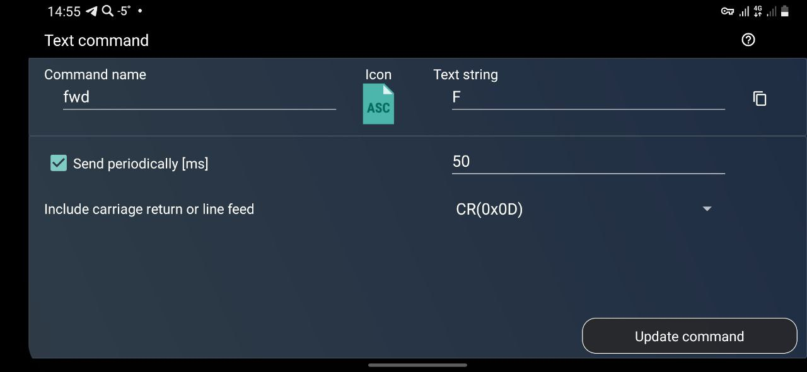

# Пример 6.1 - Первые покатушки

В этом примере вы научитесь дистанционо управлять своим роботом с телефона при помощи bluetooth модуля. Вы познакомитесть с простейшей системой команд и реализуете базовый функционал, благодаря чему ваш робот будет резво отрабатывать ваши команды с телефона

## Обяснение кода:
Программа управляет двумя электродвигателями робота через Bluetooth-модуль. Она получает команды через последовательный порт, интерпретирует их и изменяет направление и скорость двигателей в зависимости от этих команд.

### 1. Инициализация
В начале программы определяются пины, к которым подключены двигатели, и устанавливается связь с Bluetooth-модулем через последовательный порт со скоростью 9600 бод.

### 2. Основной цикл
В основном цикле программы происходят следующие шаги:

- Приём команд: Программа постоянно проверяет наличие новых данных в последовательном порту. Если приходит команда, она анализируется и принимается решение о дальнейших действиях.
- Интерпретация команд: Допустимые команды включают движение вперёд (F), назад (B), влево (L), вправо (R) и остановка (S). После приёма команды обновляется таймер актуальности команды.
- Управление двигателями: В зависимости от принятой команды, программа изменяет направление вращения двигателей и их скорость. Например, при команде «вперед» оба двигателя вращаются в одном направлении с одинаковой скоростью.
- Контроль актуальности команды: Если в течение заданного времени (65 мс) не поступает новая команда, предыдущая команда считается устаревшей, и двигатель останавливается.

## Приложение для телефона

Для разработки данного примера использовалось приложение [Bluetooth Commander v 9.7](https://play.google.com/store/apps/details?id=masar.gbc&pcampaignid=web_share).

В приложении была выбрана режим джойстика, где каждая кнопка соответствовала определенной команде:

- Кнопка "вперед" Text(F) для движения вперед,
- Кнопка "назад" Text(B) для движения назад,
- Кнопка "налево" Text(L) для поворота влево,
- Кнопка "направо" Text(R) для поворота вправо.

Для всех кнопок был установлен режим периодической отправки команд с интервалом в 50 мс.

Кроме того, в настройках самого джойстика был активирован режим периодической отправки по удерживанию, вместо стандартного режима фиксации по нажатию. Этот режим гарантирует непрерывную отправку команд до тех пор, пока пользователь держит кнопку нажатой, что особенно полезно для плавного управления движением робота.

Пример настройки кнопки джойстика в приложении: 
